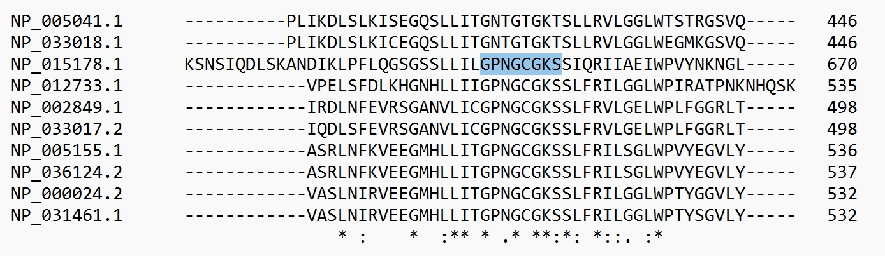

# Walker A Motif Conservation in ABC Transporters

> *Analysis of the ATP-binding motif in the ABC transporter protein family across three species*

---

## 📖 Overview

This project analyzes the conservation of the **Walker A motif (P-loop)** — the ATP-binding site of ABC transporters. The study includes **10 protein sequences** from human, mouse, and yeast.

### Key findings

- **Motif identified:** `GPNGCGKS` (Walker A / P-loop)
- **Conservation:** Present in **8 out of 10** sequences
- **Variant found:** `TGTGKTS` in 2 sequences (human ABCD4, mouse Abcd4)
- **Core residues:** Glycines and lysine — essential for ATP binding — are **100% conserved** in all variants

### Conclusion

The motif is **highly conserved** but **not absolutely invariant**. The presence of natural variants shows that some positions tolerate changes, but the functional core (glycines and lysine) must remain intact.

---

## 📊 Dataset

| Species | Proteins | Accession numbers |
|---------|----------|-------------------|
| Human | ABCD1, ABCD2, ABCD3, ABCD4 | NP_000024.2, NP_005155.1, NP_002849.1, NP_005041.1 |
| Mouse | Abcd1, Abcd2, Abcd3, Abcd4 | NP_031461.1, NP_036124.2, NP_033017.2, NP_033018.1 |
| Yeast | Pxa1p, Pxa2p | NP_015178.1, NP_012733.1 |

---

## 🔬 Methods

1. **Data collection** — sequences retrieved from NCBI Protein database
2. **FASTA preparation** — all sequences combined into a single multi-FASTA file
3. **Multiple sequence alignment** — performed using Clustal Omega
4. **Motif identification** — manual search for `GPNGCGKS` in the alignment
5. **Visualization** — sequence logo generated using WebLogo

---

## 📈 Results

| Feature | Result |
|---------|--------|
| Canonical motif | `GPNGCGKS` |
| Variant motif | `TGTGKTS` (human ABCD4, mouse Abcd4) |
| Sequences with canonical motif | 8/10 (80%) |
| Key residue conservation | Glycines (positions 1,4) and lysine (position 7) — 100% |

### Sequence Logo

### Motif in Alignment

---

## 📁 Repository Structure

